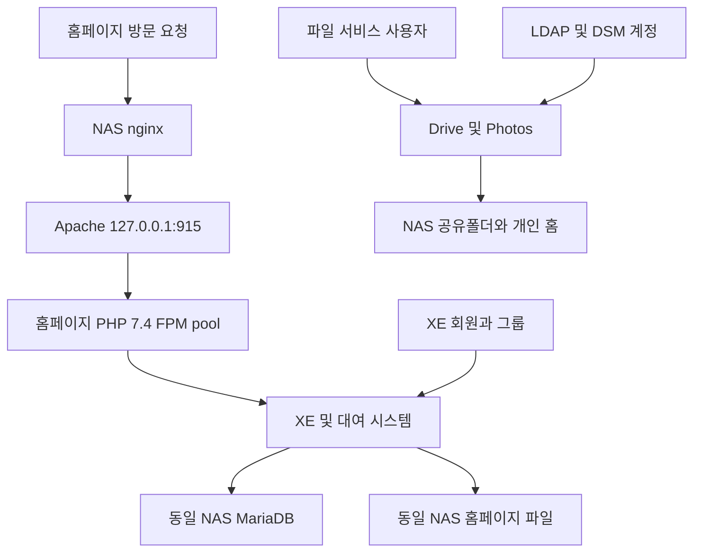

# 홈페이지 안정성 조사 서비스 배치

확인일: 2026-10-03. 상태: 1차 읽기 전용 확인. [조사 계획](../website-stability-investigation-plan.md)과 [기존 표본](../nas-survey-20261002-03.md)을 함께 읽는다.

## 현재 확인된 경로

이 그림의 선은 확인된 주요 경로다. 파일 서비스의 개별 내부 DB, 네트워크 외부 장비, 백업 목적지는 아직 전체 확인하지 않았다. LDAP과 XE 사이의 자동 계정 연결은 확인되지 않았다.

| 구성 | 근거 | 안정성 검토 지점 |
|---|---|---|
| nginx | 홈페이지 vhost와 service 설정 | Apache 응답 대기 60초, 현재 요청 시간 지표 필요 |
| Apache | 127.0.0.1:915, 해당 vhost의 FPM 소켓 | Apache access log는 기본 설정에서 /dev/null. nginx 로그와 연결 필요 |
| 홈페이지 PHP | systemd의 PHP7.4 FPM unit, child 최대 12 | CPU 포화, OPcache 적재 상태, 처리 대기 |
| 다른 PHP | PHP8.0 FPM은 별도 프로필과 phpMyAdmin 소유 소켓 | 설치 버전 수를 모두 홈페이지 부하로 합산하지 않음 |
| XE | /volume1/kitel_web/xe | 캐시, 검색, 레거시 확장, 지원되는 PHP로 이전 가능성 |
| 대여 | 같은 XE 인증·DB 연결을 사용 | 웹·DB 이동 시 인증과 거래 데이터 함께 검증 |
| MariaDB | NAS MariaDB10 패키지 | 주요 XE 테이블 MyISAM, 매우 작은 key buffer 확인 |
| Drive와 Photos | 동일 NAS 패키지·공유폴더 | 동기화·검색·사진 처리의 시간별 자원 경쟁은 미검증 |
| LDAP | NAS DirectoryServer | 인증 의존성, 회원 상태 변경과 권한 회수 |
| 백업 | HyperBackup 설치와 프로세스 존재 | 백업 성공, 대상의 독립성, 복구 가능성은 미확인 |

## 분리 배치를 평가할 때의 조건

웹 프로세스만 옮기고 DB를 NAS에 유지하면 DB·NAS 장애 의존성이 남는다. 별도 웹 환경을 검토할 때 홈페이지 DB와 필수 이미지·파일의 배치도 함께 평가한다. NAS 전체 공유폴더를 웹 계정에 읽기/쓰기 연결하지 않는다.

권한 관리 화면을 한곳으로 모으는 것과 모든 서비스를 같은 컴퓨터에 배치하는 것은 별개다. Drive 장애 시 홈페이지 기본 화면·로그인이 가능한지, 권한 변경 반영 실패를 관리자가 확인하고 재처리할 수 있는지가 설계 조건이다.
